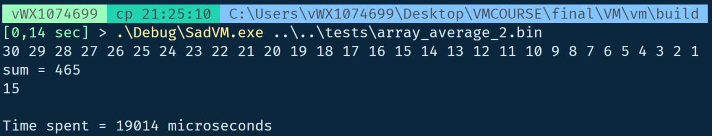
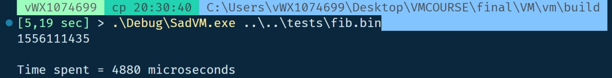

# SadVM (Serega Aznaur Danila VM)
Register-based staticly-typed virtual machine 
================================================== 
Time measurement results:

Average of 30 array elements

1000-th fibonacci number

================================================== 
Build:  

1) Assembler:  
cd assembler   
cd build 
cmake .. 
cmake --build . 
./Assembler.exe ../../tests/array_average.asm 

2) VM: 
cd vm 
cd build 
cmake .. 
cmake --build . 
./SadVM.exe ../../tests/array_average.bin 
  
